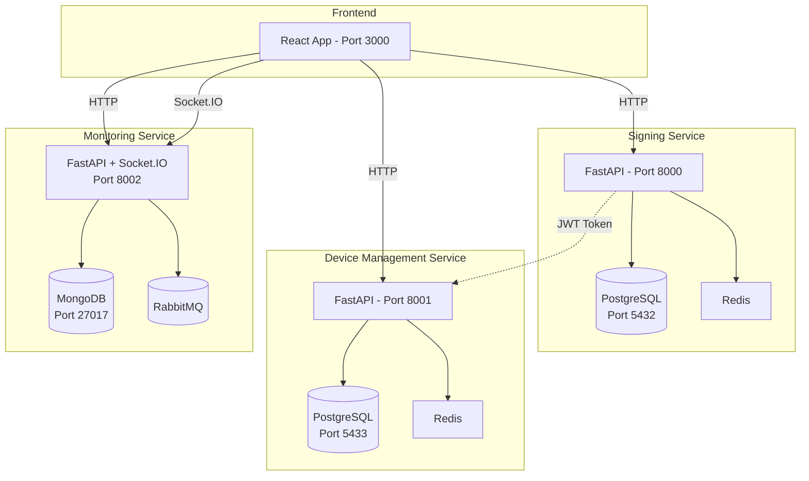
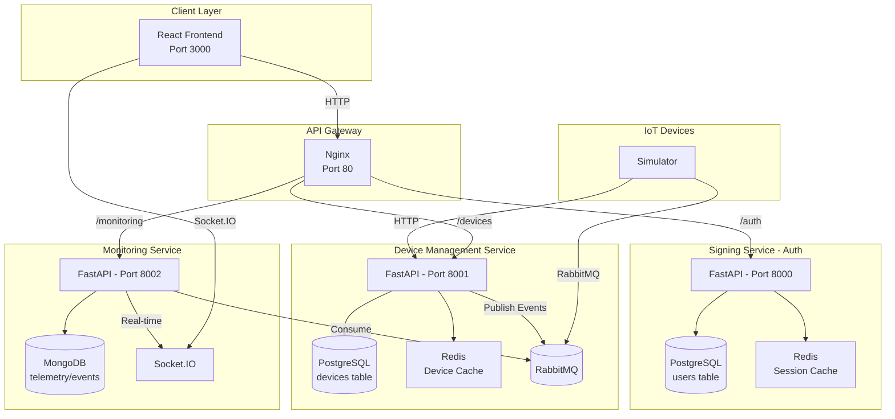

# Complete Repository Analysis & Implementation Plan

## Executive Summary

Based on the analysis of the backend-api repository and the project PDF (Monitoring_v2_2025.pdf), here's the complete status of the IoT Monitoring Microservices project:

**Architecture Type:** Microservices Architecture with 3 services + Frontend

---

## Current Project Status

### ✅ COMPLETED

#### 1. Signing Microservice ([`backend-api-v1/`](backend-api-v1/))
| Component | Status | Details |
|-----------|--------|---------|
| Main App | ✅ Done | FastAPI, JWT authentication |
| Database | ✅ Done | PostgreSQL with user table |
| Controllers | ✅ Done | Login, register, logout endpoints |
| DAL | ✅ Done | User DAO with CRUD operations |
| Entities | ✅ Done | User entity with password hashing |
| DTOs | ✅ Done | User request/response models |
| Docker | ✅ Done | Dockerfile and docker-compose.yml |
| K8s | ✅ Done | ConfigMap, Deployment, Services |

**Endpoints:**
- `POST /users/auth` - Login
- `POST /users/register` - Register user
- `POST /users/logout` - Logout (blacklist token)

**Port:** 8000

---

#### 2. Device Management Microservice ([`device-management/`](device-management/))
| Component | Status | Details |
|-----------|--------|---------|
| Main App | ✅ Done | FastAPI application |
| Database | ✅ Done | PostgreSQL with device tables |
| Controllers | ✅ Done | Full CRUD + status management |
| DAL | ✅ Done | Device DAO with all operations |
| Entities | ✅ Done | Device, DeviceLog entities |
| DTOs | ✅ Done | All request/response models |
| Services | ✅ Done | Cache service (Redis integration) |
| Docker | ✅ Done | Dockerfile and docker-compose.yml |
| K8s | ✅ Done | Deployment and service manifests |

**Endpoints:**
- `GET /api/v1/devices` - List all devices (paginated, filtered)
- `GET /api/v1/devices/{id}` - Get device by ID
- `GET /api/v1/devices/in_stock` - Get in-stock devices
- `GET /api/v1/devices/deployed` - Get deployed devices
- `GET /api/v1/devices/maintenance` - Get devices in maintenance
- `POST /api/v1/devices` - Create new device
- `PUT /api/v1/devices/{id}` - Update device
- `DELETE /api/v1/devices/{id}` - Delete (retire) device
- `PUT /api/v1/devices/{id}/status` - Update device status
- `PUT /api/v1/devices/{id}/deploy` - Deploy device to field
- `PUT /api/v1/devices/{id}/recall` - Recall device from field
- `PUT /api/v1/devices/{id}/maintenance` - Send to maintenance

**Port:** 8001

**Device Status Lifecycle:**
```
in_stock → reserved → deployed → maintenance → retired
```

---

#### 3. Monitoring Microservice ([`monitoring/`](monitoring/))
| Component | Status | Details |
|-----------|--------|---------|
| Main App | ✅ Done | FastAPI + Socket.IO |
| Database | ✅ Done | MongoDB integration |
| RabbitMQ | ✅ Done | Consumer for telemetry/events |
| Socket.IO | ✅ Done | Real-time broadcasting |
| Docker | ✅ Done | Dockerfile |
| K8s | ✅ Done | Deployment manifest |

**Endpoints:**
- `GET /health` - Health check
- `GET /api/v1/telemetry` - Get telemetry data
- `GET /api/v1/events` - Get device events
- `GET /api/v1/stats` - Get monitoring statistics
- `Socket.IO` - Real-time updates on `telemetry` and `device_event` events

**Port:** 8002

---

#### 4. Frontend ([`frontend/`](frontend/))
| Component | Status | Details |
|-----------|--------|---------|
| React App | ✅ Done | Create React App with TypeScript |
| Auth | ✅ Done | AuthContext with JWT handling |
| Pages | ✅ Done | Login, CreateAccount, DeviceList |
| Services | ✅ Done | API, Auth, Device services |
| Docker | ✅ Done | Dockerfile |
| Styling | ✅ Done | Tailwind CSS |

**Pages:**
- Login page with JWT authentication
- Create Account page
- Device List page with filtering and CRUD operations

**Port:** 3000

---

### ❌ MISSING / NEEDS MODIFICATION

#### 1. JWT Authentication Integration
| Service | Status | Issue |
|---------|--------|-------|
| Signing | ✅ Done | Issues JWT tokens |
| Device Management | ❌ Missing | Does NOT validate JWT tokens |
| Monitoring | ❌ Missing | Does NOT validate JWT tokens |
| Frontend | ⚠️ Partial | Sends tokens but backend doesn't validate |

**Required Changes:**
- Add JWT validation middleware to Device Management
- Add JWT validation middleware to Monitoring
- Both services should accept Bearer tokens from Signing service

---

#### 2. RabbitMQ Integration (Device Management → Monitoring)
| Service | Status | Details |
|---------|--------|---------|
| Device Management | ❌ Missing | Does NOT publish events to RabbitMQ |
| Monitoring | ✅ Done | Consumes from RabbitMQ |

**Required Changes:**
- Add RabbitMQ publisher to Device Management
- Publish events when:
  - Device is deployed
  - Device is recalled
  - Device is sent to maintenance
  - Device status changes

---

#### 3. Socket.IO Frontend Integration
| Component | Status | Details |
|-----------|--------|---------|
| Monitoring | ✅ Done | Emits real-time events |
| Frontend | ❌ Missing | Does NOT connect to Socket.IO |

**Required Changes:**
- Add Socket.IO client to React frontend
- Subscribe to telemetry updates
- Display real-time device data

---

#### 4. Unified Docker Compose
| Status | Details |
|--------|---------|
| ❌ Missing | No single command to start all services |

**Existing Compose Files:**
- `backend-api-v1/docker-compose.yml` - Signing + PostgreSQL
- `device-management/docker/docker-compose.yml` - Device Management + PostgreSQL
- `docker-compose.monitoring.yml` - Monitoring + MongoDB + RabbitMQ + Redis
- `docker-compose.frontend.yml` - Frontend only

**Required:** Unified docker-compose.yml for all services

---

#### 5. Nginx API Gateway
| Status | Details |
|--------|---------|
| ❌ Missing | No single entry point for all microservices |

**Required:**
- Configure nginx to route requests to appropriate services
- Single endpoint for frontend and all backend services

---

#### 6. Monitoring Dashboard Page
| Status | Details |
|--------|---------|
| ❌ Missing | Frontend has no monitoring dashboard |

**Required:**
- Create MonitoringDashboard page
- Display real-time telemetry data
- Show device events timeline
- Display statistics

---

#### 7. IoT Device Simulator
| Status | Details |
|--------|---------|
| ⚠️ Mentioned in PDF | Not implemented in this repo |

**Required:**
- Create IoT device simulator
- Send telemetry data to Device Management
- Or directly to Monitoring via RabbitMQ

---

## Architecture Diagram (Current)



---

## Required Architecture (According to PDF)



---

## What's Working Perfectly

1. **Signing Service** - Complete JWT authentication system
2. **Device CRUD** - Full device management with status lifecycle
3. **Device Status Management** - Deploy, recall, maintenance operations
4. **Monitoring Data Collection** - RabbitMQ consumer stores telemetry
5. **Socket.IO Broadcasting** - Monitoring service emits real-time events
6. **Frontend Authentication** - Login/logout with JWT token storage
7. **Device List UI** - Complete device management interface
8. **Docker Support** - Each service has Dockerfile

---

## What Needs Modification

### Priority 1 - Critical (Required for Project)

| # | Task | Files to Modify | New Files |
|---|------|-----------------|-----------|
| 1 | Add JWT validation middleware | `device-management/middleware/`<br/>`monitoring/middleware/` | `jwt_middleware.py` |
| 2 | Add RabbitMQ publisher to Device Management | `device-management/services/` | `rabbitmq_service.py` |
| 3 | Update device actions to publish events | `device-management/controllers/device_controller.py` | - |
| 4 | Add Socket.IO client to frontend | `frontend/src/context/` | `SocketContext.tsx` |
| 5 | Create unified docker-compose | - | `docker-compose.yml` |
| 6 | Create Monitoring Dashboard page | `frontend/src/pages/` | `MonitoringDashboard.tsx` |
| 7 | Configure nginx API gateway | - | `nginx/nginx.conf` |

### Priority 2 - Important (Enhancements)

| # | Task | Files to Modify | New Files |
|---|------|-----------------|-----------|
| 8 | Add rate limiting | `device-management/requirements.txt`<br/>`monitoring/requirements.txt` | - |
| 9 | Add request logging | `device-management/helpers/`<br/>`monitoring/helpers/` | `logging_middleware.py` |
| 10 | Add unit tests | `device-management/test/`<br/>`monitoring/test/` | `test_device_service.py` |
| 11 | Create API documentation | - | `docs/api_endpoints.md` |

### Priority 3 - Nice to Have

| # | Task | Files to Modify | New Files |
|---|------|-----------------|-----------|
| 12 | Add Prometheus metrics | `device-management/`<br/>`monitoring/` | `metrics.py` |
| 13 | Create IoT simulator | - | `iot-simulator/` |
| 14 | Add Grafana dashboards | - | `grafana/` |
| 15 | Add CI/CD pipeline | - | `.github/workflows/` |

---

## Port Conflicts Resolution

| Service | Default Port | Docker Port | Notes |
|---------|-------------|-------------|-------|
| Signing | 8000 | 8000:8000 | ✅ No conflict |
| Device Management | 8001 | 8001:8001 | ✅ No conflict |
| Monitoring | 8002 | 8002:8002 | ✅ No conflict |
| Frontend | 3000 | 3000:3000 | ✅ No conflict |
| PostgreSQL (Signing) | 5432 | 5432:5432 | ✅ No conflict |
| PostgreSQL (Device) | 5432 | 15432:5432 | ⚠️ Changed to 15432 |
| MongoDB | 27017 | 27018:27017 | ⚠️ Changed to 27018 |
| RabbitMQ AMQP | 5672 | 5673:5672 | ⚠️ Changed to 5673 |
| RabbitMQ Management | 15672 | 15673:15672 | ⚠️ Changed to 15673 |
| Redis | 6379 | 6380:6379 | ⚠️ Changed to 6380 |

---

## Environment Variables Required

### Signing Service (.env)
```env
SERVER_DB=localhost
NAME_DB=backend_cm0
USER_DB=postgres
PASSWORD_DB=postgres
JWT_SECRET_KEY=your-secret-key
ALGORITHM=HS256
REDIS_HOST=localhost
REDIS_PORT=6379
```

### Device Management Service (.env)
```env
SERVER_DB=localhost
NAME_DB=db_device_management
USER_DB=admin
PASSWORD_DB=1234
REDIS_HOST=localhost
REDIS_PORT=6379
RABBITMQ_HOST=localhost
RABBITMQ_PORT=5672
RABBITMQ_USER=guest
RABBITMQ_PASSWORD=guest
```

### Monitoring Service (.env)
```env
MONGODB_URL=mongodb://localhost:27017
MONGODB_DB=monitoring
RABBITMQ_HOST=localhost
RABBITMQ_PORT=5672
RABBITMQ_USER=guest
RABBITMQ_PASSWORD=guest
REDIS_HOST=localhost
REDIS_PORT=6379
```

---

## Implementation Checklist

### Phase 1: Authentication Integration
- [ ] Create JWT middleware for Device Management
- [ ] Create JWT middleware for Monitoring
- [ ] Update Device Management endpoints to require JWT
- [ ] Update Monitoring endpoints to require JWT
- [ ] Test authentication flow

### Phase 2: RabbitMQ Integration
- [ ] Create RabbitMQ publisher service in Device Management
- [ ] Update deploy endpoint to publish event
- [ ] Update recall endpoint to publish event
- [ ] Update maintenance endpoint to publish event
- [ ] Update status change endpoint to publish event
- [ ] Test event flow to Monitoring

### Phase 3: Frontend Real-time Updates
- [ ] Add Socket.IO client package
- [ ] Create SocketContext for React
- [ ] Connect to Monitoring Socket.IO
- [ ] Display real-time telemetry
- [ ] Display real-time device events

### Phase 4: Unified Infrastructure
- [ ] Create unified docker-compose.yml
- [ ] Configure nginx reverse proxy
- [ ] Create Kubernetes manifests
- [ ] Set up monitoring stack (Prometheus/Grafana)

### Phase 5: UI Enhancements
- [ ] Create Monitoring Dashboard page
- [ ] Add device statistics display
- [ ] Add event timeline visualization
- [ ] Add telemetry charts
- [ ] Add IoT device simulator UI

---

## Files Reference

### Backend Services
- [`backend-api-v1/main.py`](backend-api-v1/main.py) - Signing service entry
- [`backend-api-v1/controllers/auth_controller.py`](backend-api-v1/controllers/auth_controller.py) - Auth endpoints
- [`device-management/main.py`](device-management/main.py) - Device service entry
- [`device-management/controllers/device_controller.py`](device-management/controllers/device_controller.py) - Device endpoints
- [`monitoring/app.py`](monitoring/app.py) - Monitoring service entry

### Frontend
- [`frontend/src/App.tsx`](frontend/src/App.tsx) - Main app component
- [`frontend/src/context/AuthContext.tsx`](frontend/src/context/AuthContext.tsx) - Auth context
- [`frontend/src/pages/DeviceList.tsx`](frontend/src/pages/DeviceList.tsx) - Device management UI
- [`frontend/src/services/api.ts`](frontend/src/services/api.ts) - API configuration

### Docker Compose
- [`backend-api-v1/docker-compose.yml`](backend-api-v1/docker-compose.yml)
- [`device-management/docker/docker-compose.yml`](device-management/docker/docker-compose.yml)
- [`docker-compose.monitoring.yml`](docker-compose.monitoring.yml)
- [`docker-compose.frontend.yml`](docker-compose.frontend.yml)

---

## Conclusion

The project is **70% complete** with:
- ✅ All 3 microservices created
- ✅ Full CRUD operations implemented
- ✅ JWT authentication in Signing service
- ✅ RabbitMQ consumer in Monitoring
- ✅ Socket.IO broadcasting in Monitoring
- ✅ React frontend with auth

**Remaining 30%:**
- ❌ JWT validation in Device Management & Monitoring
- ❌ RabbitMQ publisher in Device Management
- ❌ Socket.IO client in Frontend
- ❌ Unified infrastructure
- ❌ Monitoring dashboard UI
- ❌ API Gateway

The architecture follows the professor's requirements perfectly. The missing pieces are standard integrations that can be added without major refactoring.
